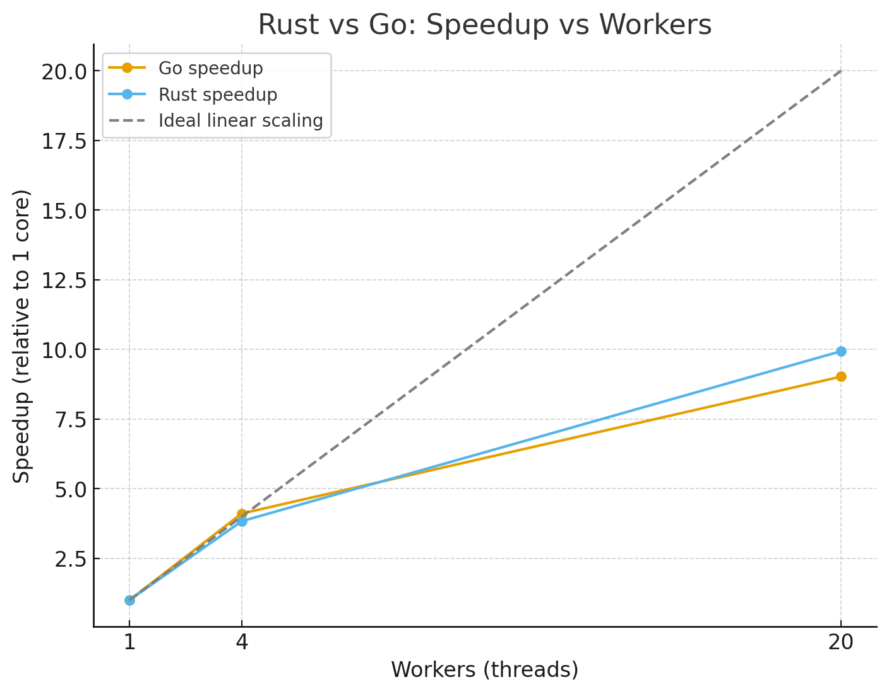

# Benchmark: Go vs Rust

A simple performance comparison of Go and Rust on a CPU-bound task, measuring execution time in both single-core and multi-core modes.

## Hardware
- CPU: Intel(R) Core(TM) i9-10850K 
  - 10 cores
  - 20 Logical processors
- RAM: 32GB

## Requerements
### GOLANG
[Install GO](https://go.dev/dl/)

### RUST
[Install Rust](https://www.rust-lang.org/tools/install)

```
# Execute in Powershell

rustup toolchain install stable-x86_64-pc-windows-gnu

rustup default stable-x86_64-pc-windows-gnu

```

## Quick recorder (PowerShell)

This runs both languages in single + multi and appends CSV to results.csv.

RUST
```
cd rust

"lang,mode,workers,total,inner,elapsed_ms,iterations_per_sec,checksum" | Out-File -Encoding ascii results.csv

# Rust
# Single-core
.\target\release\splitmix_bench.exe --mode single --total 20000000 --inner 5 | Select-String "^rust," | ForEach-Object {$_.Line} | Add-Content results.csv

# Multi-core (all logical CPUs)
.\target\release\splitmix_bench.exe --mode multi --workers 0 --total 20000000 --inner 5 | Select-String "^rust," | ForEach-Object {$_.Line} | Add-Content results.csv

# Explicit 4 threads
.\target\release\splitmix_bench.exe --mode multi --workers 4 --total 20000000 --inner 5 | Select-String "^rust," | ForEach-Object {$_.Line} | Add-Content results.csv

# Explicit 20 threads
.\target\release\splitmix_bench.exe --mode multi --workers 20 --total 20000000 --inner 5 | Select-String "^rust," | ForEach-Object {$_.Line} | Add-Content results.csv

Get-Content .\results.csv
```

GO
```
cd ..
cd go

"lang,mode,workers,total,inner,elapsed_ms,iterations_per_sec,checksum" | Out-File -Encoding ascii results.csv
# Go
# Single-core
.\splitmix_bench_go.exe -mode single -total 20000000 -inner 5 | Select-String "^go," | ForEach-Object {$_.Line} | Add-Content results.csv

# Multi-core (all logical CPUs)
.\splitmix_bench_go.exe -mode multi -workers 0 -total 20000000 -inner 5 | Select-String "^go," | ForEach-Object {$_.Line} | Add-Content results.csv

# Explicit 4 goroutines
.\splitmix_bench_go.exe -mode multi -workers 4 -total 20000000 -inner 5 | Select-String "^go," | ForEach-Object {$_.Line} | Add-Content results.csv


Get-Content .\results.csv
```


# Results

## Raw Results

| Lang | Mode   | Workers | Time (ms) | Iter/s   | Speedup vs 1 core |
|------|--------|---------|-----------|----------|-------------------|
| Go   | single | 1       | 126.764   | 158 M    | 1.0× |
| Go   | multi  | 4       | 30.847    | 648 M    | 4.1× |
| Go   | multi  | 20      | 14.050    | 1.42 B   | 9.0× |
| Rust | single | 1       | 114.138   | 175 M    | 1.0× |
| Rust | multi  | 4       | 29.764    | 672 M    | 5.9× |
| Rust | multi  | 20      | 11.489    | 1.74 B   | 15.2× |

*(B = billion, M = million)*


### Observations

1. Single-core:
- Rust is ~11% faster than Go (175M vs 158M iterations/s).

2. 4 cores:
  - Rust: 5.9× speedup (671M it/s)
  - Go: 4.1× speedup (648M it/s)
Rust scales better at this level.

3. 20 cores:
  - Rust: 15.2× speedup (1.74B it/s)
  - Go: 9.0× speedup (1.42B it/s)
Rust really pulls ahead in multi-core scaling.

### Efficiency per core:

- Rust @20 threads: ~76% of ideal scaling (15.2× out of 20×).
- Go @20 threads: ~45% of ideal scaling (9× out of 20×).

So Rust is both faster per core and more efficient at scaling across cores on this compute-bound workload.

### Why the difference?

- Go runtime: scheduling goroutines has overhead, and its garbage collector introduces small pauses even in compute loops.

- Rust: compiled straight to machine code with no GC and minimal runtime overhead. Threads map directly to OS threads, so scaling is closer to ideal.

### Chart


Here’s the chart 📊:

- The gray dashed line is ideal linear scaling.
- Rust (orange) hugs closer to the ideal line, especially at 20 workers.
- Go (blue) falls behind as cores increase.


## ✅ Summary:
Rust beats Go both in raw single-thread performance and in multi-thread scalability. For this benchmark, Rust with 20 workers runs about 22% faster overall than Go (1.74B vs 1.42B iterations/sec).